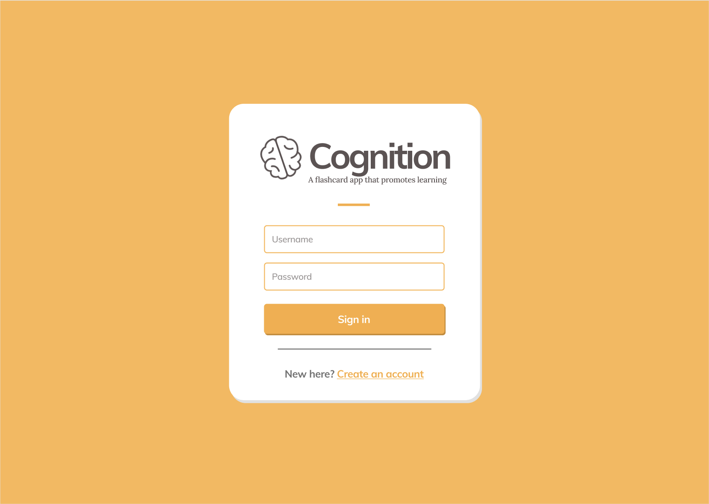

# Cognition

## Description

Cognition is - plain and simple - a flashcard application. If you've used [Quizlet](https://quizlet.com/), Cognition
should feel quite familiar.

## User stories, MVP and future improvements

### Minimum Viable Product (MVP)

As a user, I want to log in to the application and have a personalized experience of the application. This means that my collection of flashcards may be different to other users' flashcards.

When logged in, I want to create, view, update and delete flashcards. After creating a flashcard, I want to group several flashcards together to form a quiz; a collection of flashcards.

Furthermore, I want to be able to exit the application and log in to continue where I left off. This means that the quizzes and flashcards are stored persistently.

### Improvements and future functionality

As a user, I want to view my streaks, in other words how many consecutive flashcards I have answered correctly. The
flashcards can be grouped by priority, for example grouped by the hardest questions or grouped by the ones I have gotten
most wrong.

As a user, I want to search quizzes and flashcards for easier and more intuitive navigation.

## Mockup screenshots

> The following are mockup screenshots from our project Figma. 
> The tentative design sketches can be found [at this Figma link](https://www.figma.com/file/dlrynKyn3KHJIdElsM12CB/Cognition-Design?node-id=0%3A1)
>

### Login Screen

### Home Screen

### Taking a Quiz

### Flashcard - Type 1 (Input)

### Flashcard - Type 2 (Guess)

