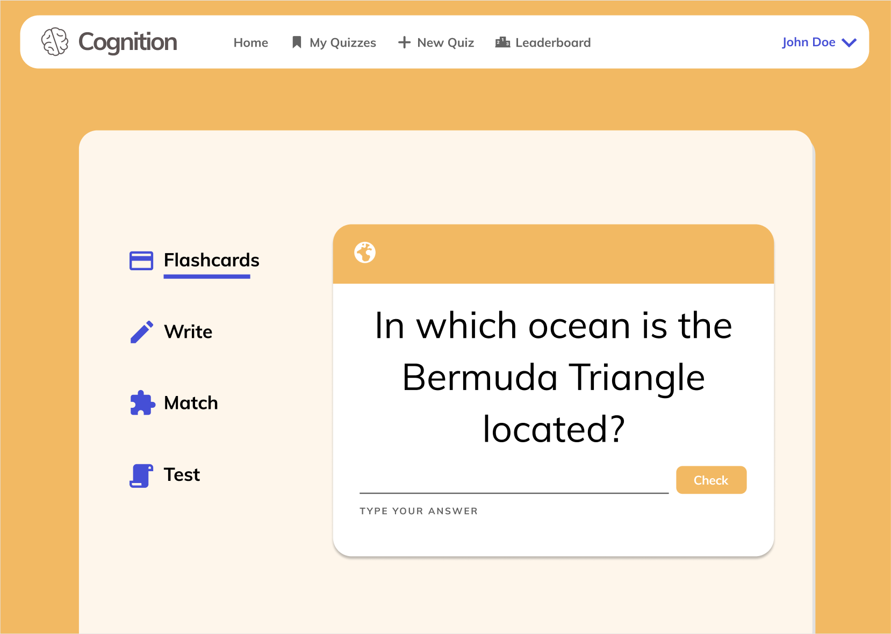
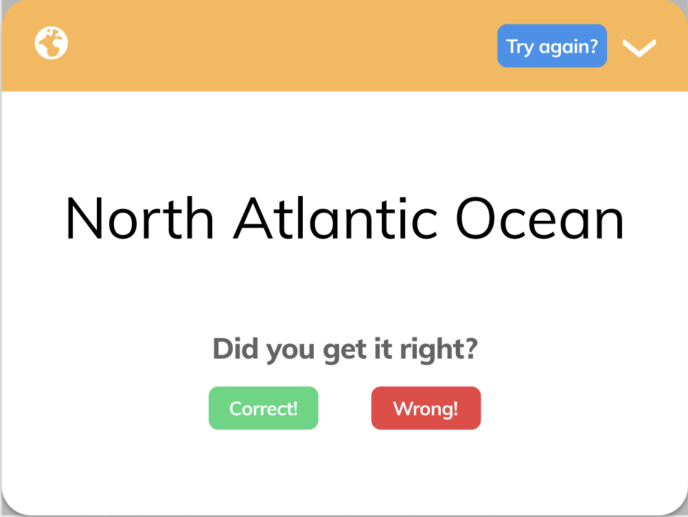

# Cognition

## Description

Cognition is - plain and simple - a flashcard application. If you've used [Quizlet](https://quizlet.com/), Cognition
should feel quite familiar.

## Packaging the application

The Cognition application can be packaged into executable applications. The Spring Boot web server gets packaged into a `.jar`, whilst the JavaFX client application gets packaged into an executable called `cognition`.

The client application and the web server are two separate applications packaged independently of each other. In other words: The client application does not know if, or care whether, the web server is running, and vice versa.

As a user, you run the application as a desktop application. **On your local machine**, this can be done by simply launching the Cognition application from your `~/Applications` directory. **Using GitPod**, you must execute the client application using the terminal.

The following guide assumes that the start directory is `cognition`.

### Packaging the Spring Boot web server

```sh
# Navigate to the api module in the cognition directory.
cd api

# Package the web server application.
mvn clean package spring-boot:repackage

# Navigate to the target directory in the api module.
cd target

# Run the web server as a .jar.
java -jar api-1.0-SNAPSHOT.jar
```

### Packaging the JavaFX client application **as a desktop application**

```sh
# Navigate to the ui module in the cognition directory.
cd ui

# Turn the client application into a desktop application.
mvn clean compile javafx:jlink jpackage:jpackage
```

A pop-up window should appear, and you'll be able to "drag" the application into your `~/Applications` directory. Open your file explorer, and simply double-click the Cognition application to launch the client application.

### Packaging the JavaFX client application **as an executable**

```sh
# Navigate to the ui module in the cognition directory.
cd ui

# Turn the client application into an executable.
mvn clean javafx:jlink

# Navigate to the target/cognition/bin directory in the ui module.
cd target/cognition/bin

# Run the executable client application.
./cognition
```

## `Makefile`

[Click here](Makefile) to read inspect the `Makefile`. Read the root [README](../README.md) for more information on how to run the application using `make`.

## Module documentation

### `api` module

[Click here](./api) to read the documentation for the `api` module.

### `core` module

[Click here](./core) to read the documentation for the `core` module.

### `ui` module

[Click here](./ui) to read the documentation for the `ui` module.

### `integration_tests` module

[Click here](./integration_tests) to read the documentation for the `integration_tests` module.

## User stories, MVP and future improvements

[Click here](../USER_STORIES.md) to read more about user stories, MVP and future improvements.

## Mockup screenshots

The following are mockup screenshots from our project Figma. The tentative design sketches can be
found [at this Figma link](https://www.figma.com/file/dlrynKyn3KHJIdElsM12CB/Cognition-Design?node-id=0%3A1).

### Login Screen


### Home Screen


#### Home Screen: Note at the end of deliverable 3

Notice how we did not include a leaderboard. This was not part of our improvements and future functionality, and were deemed redundant in the final design by us.

Additionally, we updated the design on the _Dashboard_ view to have a welcoming message explaining the application. The _My Quizzes_ view now displays your personal quizzes.

### Taking a Quiz



#### Taking a Quiz: Note at the end of deliverable 3

We did not implement different kinds of quizzes, e.g. _Write_ quizzes or _Match_ quizzes. This was not part of our improvements and future functionality, and were deemed redundant in the final design by us.

### Flashcard - Type 1 (Input)


### Flashcard - Type 2 (Guess)



