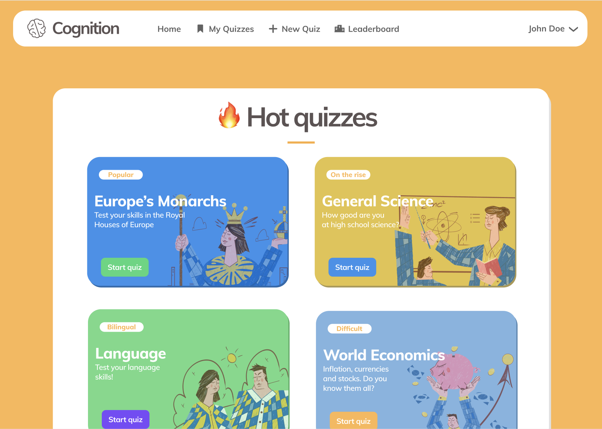
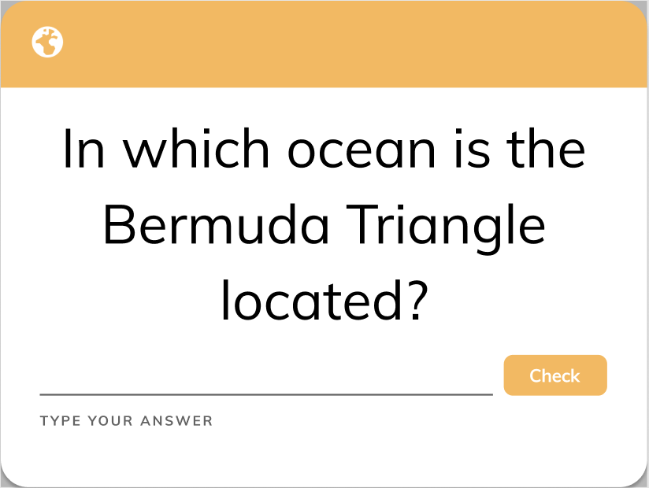
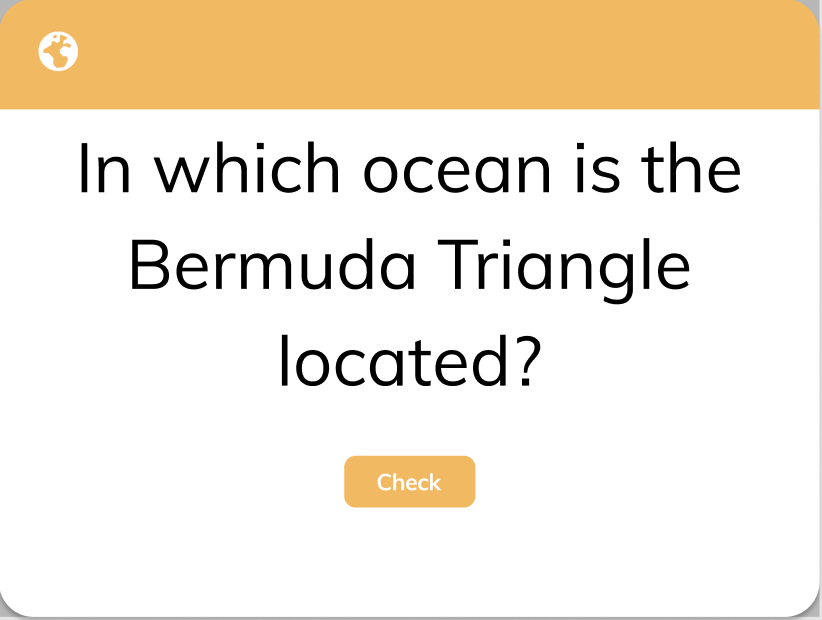

# Design

## Description

The following screenshots are provisional design sketches showing the _Login_, _Home_ and _Quiz_ view, as well as a
contemporary design for the flashcards themselves.

The tentative design sketches can be
found [here at Figma](https://www.figma.com/file/dlrynKyn3KHJIdElsM12CB/Cognition-Design?node-id=0%3A1).

## Login Screen

## Home Screen

## Taking a Quiz

## Flashcard - Type 1 (Input)

## Flashcard - Type 2 (Guess)

