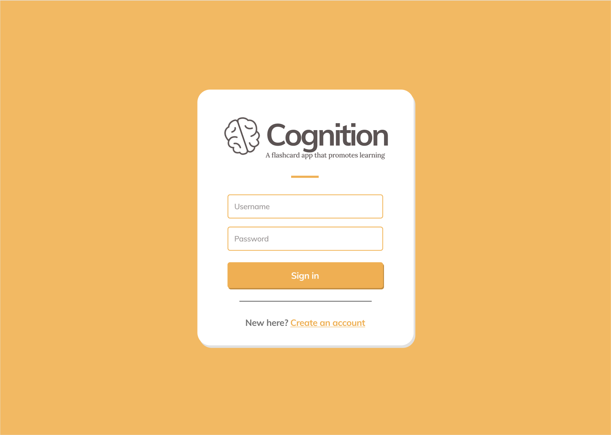

# Release 1

## Build using Maven

The `cognition` Java project uses Maven to build and run.

```sh
# Navigate to the cognition directory
cd cognition

# Install dependencies and run all tests
mvn install

# Run frontend (after running mvn install)
mvn javafx:run -f ui/pom.xml

# Run Spring Boot server (after running mvn install)
mvn spring-boot:run -f api/pom.xml
```

## Gitpod

The application can be developed and executed using Gitpod. Use the badge in the [`REAMDE.md`](../../README.md) to
launch the application using Gitpod.

Each developer is encouraged to use their IDE of choice, as long as all functionality also supports using Gitpod.

## Milestones

The group will use milestones on GitLab to monitor our sprints, and thus link issues to each sprint. Each sprint lasts 1
week.

Milestones that span over a longer period of time will also be created in order to keep an overview of the main
deliverables ("Gruppeinnlevering 1", "Gruppeinnlevering 2", etc...).

## Issue tracking

### Templates

The group have set up GitLab issue templates to streamline the process of creating a new issue. A reference guide can be
found using [this link](https://docs.gitlab.com/ee/user/project/description_templates.html).

An issue can either be a [**Feature Request**](../../.gitlab/issue_templates/Feature.md), a [**
Bug**](../../.gitlab/issue_templates/Bug.md) or **Uncategorized**. Please inspect the raw Markdown code when viewing
these templates.

The issue templates are adapted to resemble an informal user story.

### Labels

Each issue is assigned one or multiple labels. An overview of our custom project labels can be found
in `Issues -> Labels` on GitLab. The labels serve to prioritze, scope and categorize the issues.

### Connecting issues to merge requests

An issue should always be closed by a merge request, unless the issue is obviously not connected to part of the code
base.

### GitLab boards

An overview of the state of an issue (backlog, in proress, done, etc...) can be found in `Issues -> Boards`.

### Scope of an issue

An issue should not be too large. The group seeks to scope issue to a maximum work length of 12 hours. If the issue must
be larger than that, the issue must have a checklist of subtasks.

#### Example

**#10 - Setup frontend**

- [x] Add dependencies
- [ ] Make controllers
- [ ] etc...

## Branches and merge requests

### Naming

Branch names should be clear and concise, and be marked with the id number of the issue it resolves.
Example: `#10-feat-frontend`.

### Description

The description of a merge request includes a **Changelog / Summary** of the new functionality added. Optionally, a
short description about how to test the new functionality can be added in order to help the code reviewer.

### Squash and merge

Before merging, the commits in the branch to merge must be squashed. This cleans up the Git timeline.

## User interface (FXML)

Please see the [UI module documentation](../../cognition/ui/README.md) for thorough documentation of its classes.

## Core

Please see the [Core module documentation](../../cognition/core/README.md) for thorough documentation of its classes.

## Persistent storage

Please see the [API module documentation](../../cognition/api/README.md) for thorough documentation of its classes.

## Continuous Integration (CI) and code quality

The module `cognition/ui` handles the user interface of the app. It applies the library [Javafx](https://openjfx.io/) to
easily create an interactive graphical interface.

So far, the user interface only consists of the login screen and has no functionality. In future updates, the interface
will be styled according to the mockup screenshots in the `README` and be a functional flashcard app.

## Continuous Intergration (CI) and code quality

The pipeline for continuous integration must succeed before merging new functionality.

The code must compile, pass all code quality checks and pass all tests.

The following tools will be used to ensure code quality:

- [Checkstyle](https://checkstyle.sourceforge.io). Validates design, checks code layout and checks code formatting.

- [Spotbugs](https://spotbugs.github.io/). Highlights potential bugs in Java code.

- [Jacoco](https://www.jacoco.org/jacoco/). Gathers test information and displays code coverage.

## Testing

New functionality should - if appropriate (which it almost always is) - be tested before it is merged.

## Design

Provisional design sketches showing the login-, home- and quiz-screen, as well as a contemporary design for the
flashcards themselves.

The tentative design sketches can be
found [here at Figma](https://www.figma.com/file/dlrynKyn3KHJIdElsM12CB/Cognition-Design?node-id=0%3A1)

### Login Screen



### Home Screen


### Taking a Quiz


### Flashcard - Type 1 (Input)


### Flashcard - Type 2 (Guess)


