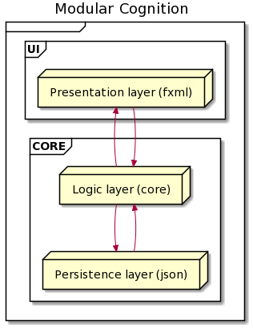
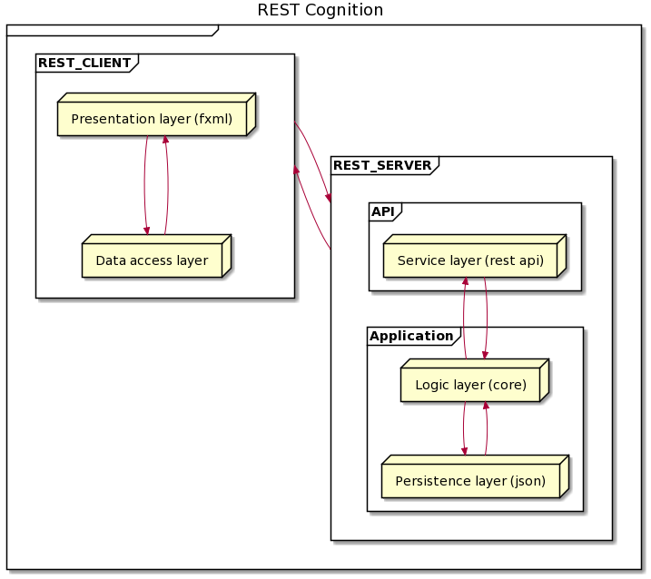

# Release 2

## Persistent Storage

### Document metaphor versus implicit memory

The Cognition application uses **implicit memory for persistent storage**. This means that when the user interacts with the application, the user does not have to worry about explicitly stating that the user wants to store data persistently.

Take [Quizlet](https://quizlet.com/) as an example. As a user, I create a quiz consisting of flashcards, and click _"Create"_. As a user, I do not care how the data is persistently stored. I only care about the data being there the next time I launch the application.

To compare, take _Microsoft Word_ - without automatic backup functionality to a cloud service - as a contrary example. When a user writes in a local Microsoft Word instance, the data is usually not automatically saved without the user's influence. If I want to keep my current progress, I go to `File -> Save As...`, and then persistently save my progress. This is an example of a document metaphor (desktop) for persistent storage.

### Local Storage

Please see the [Core module documentation](../../cognition/core/README.md) for a thorough documentation of its classes, including local persistent storage. This documentation also includes the definition of the file format used.

## Continuous Integration

The repository uses continuous integration (hereby referred to as CI) pipeline before merging new features to the main branch. This pipeline runs the following Maven commands using a Maven image:

```sh
# Clean the current build, install dependencies in all modules and test all modules
mvn clean install

# Compile the Java application
mvn compile

# Clean and test again. This is redundant, but used as a safety measure to ensure that all tests pass.
mvn clean test
```

The pipeline for continuous integration must succeed before merging new functionality.

The code must compile, pass all code quality checks and pass all tests.

The configuration for the pipeline can be found in [`.gitlab-ci.yml`](../../.gitlab-ci.yml). It uses settings found in [`.m2/settings.xml`](../../.m2/settings.xml).

Please note that we do not run tests in the `ui` module in GitLab, as it is not supported. This is confirmed by the IT1901 staff. Our solution to this problem is to test the `api` and `core` module in the CI pipeline, and then test the `ui` module locally before merging. That way, all tests are validated before merging.

## Architecture Documentation

The current architecture of the project is a 2-tier application that consists of a `ui` module and a `core` module. Note that the `api` module exists, but has no real functionality. The `core` module is further divided into two layers; core logic and persistent storage (JSON). This functionality is split into two Java packages: `core` and `json` respectively. Henceforward, the architectural style of the product is going to transition towards a REST application.

### Advantages of a 2-tier application

The modular architecture provides a set of advantages. For instance, the isolation of layers provides the opportunity to change one layer without affecting other layers. Furthermore, when layers are separated by the part of the application they handle, the code becomes more manageable, improving the project's workflow. Each layer can also be independently tested. On the other hand, modular applications are a de facto standard, well known by developers, making the architectural choice modern and relevant and facilitating navigation through the codebase. Finally, a 2-tier application can quickly get running without much complexity.

### Disadvantages of a 2-tier application

There are, however, some disadvantages to a 2-tier application. It is possible that going through 3 layers only to create one database record might be too complex. In addition, when all layers directly depend on a layer below, it is not easy to swap out one layer with another one.

### Current architecture (deliverable 2)



The user interface module (`ui`) consists of a presentation layer that communicates with the `core` module, specifically the core logic layer (`core` package). This layer communicates with the persistence layer (`json` package) and then sends the information back to the `ui`.

### Future architecture



The intended future architectural style of the Cognition application is a REST application. REST (Representational State Transfer) applications use web services to communicate between the client and the REST server. Some constraints of this type of architectural style are statelessness, cacheability, and layered system. The communication between the client and the server is done with standard HTTP methods (e.g., `GET`, `POST`, `PUT`, `PATCH`, and `DELETE`).

In this case, the client-side will consist of a presentation layer built with FXML and a data access layer that provides all functionality and data not located in the REST server. The client communicates with the REST server via its API, and the API then communicates with the application tier of the server. This process functions backward to send data to the client. This highly resembles the architecture of web applications.

## Work habits, workflow and code quality

We use automated tests in order to decrease developer effort of manually running and re-running tests. See the `## Continuous Integration` section above for more information.

The following tools is used to ensure code quality:

- [Checkstyle](https://checkstyle.sourceforge.io). Validates design, checks code layout and checks code formatting.

- [Spotbugs](https://spotbugs.github.io/). Highlights potential bugs in Java code.

- [Jacoco](https://www.jacoco.org/jacoco/). Gathers test information and displays code coverage.

## Test coverage

The focus for group deliverable 2 was robust local, persistent storage, and some frontend functionality. To enforce this, we have written tests for `UserStorage` and `QuizStorage`.

### Local storage (`core`)

These tests can be found here: [`UserStorageTest`](../../cognition/core/src/test/java/json/UserStorageTest.java) and [`QuizStorageTest`](../../cognition/core/src/test/java/json/QuizStorageTest.java).

These tests validate the you can create, read, update and delete the respective Java models. Furthermore, the tests check some edge cases. For more information, see the Javadoc in the respective classes.

### Frontend (`ui`)

These tests can be found [here](../../cognition/ui/src/test/java/ui).

Because we have focused on not advancing too fast without good test coverage, but rather fully develop views before adding new views, we currently test [`DashboardTest`](../../cognition/ui/src/test/java/ui/DashboardTest.java), [`LoginTest`](../../cognition/ui/src/test/java/ui/LoginTest.java) and [`RegisterTest`](../../cognition/ui/src/test/java/ui/RegisterTest.java).

[`CreateQuizController`](../../cognition/ui/src/test/java/ui/CreateQuizController.java) is not fully implemented, and therefore not tested either. This is why the ui module only has a total test coverage of 69%.

Currently, the ui module only has 69% test coverage. The reason for this is that CreateQuizController is not yet fully implemented and therefore not tested.
For more information, see the Javadoc in the respective classes.

## Modularization

### User Interface

Please see the [UI module documentation](../../cognition/ui/README.md) for a thorough documentation of its classes.

### Core and persistent local storage

Please see the [Core module documentation](../../cognition/core/README.md) for a thorough documentation of its classes.

### REST API

Please see the [API module documentation](../../cognition/api/README.md) for a thorough documentation of its classes.

## Reflection

### Storage format

Currently, all data is written to one file: `~/it1901-gr2103/cognition/users.json`. In this file, the users are stored in an array with their corresponding quizzes. The advantage of this solution is that it is very comfortable to work with. On the contrary, we recognize that in an upscaled version of the app, this would be very inefficient. All users are read and written every time one single flashcard is updated or added. However, this is only a small scale project, and we are planning on moving to a database further on in the project.

### Spotbugs and resource leaks

During the group deliverable 2 milestones, we expanded upon the local, persistent storage. This, of course, included writing to file using the Java `FileWriter`. Spotbugs helped us expose a potential resource leak: We had an edge case where the `FileWriter` would not be flushed and closed correctly. This is a prime example of why one should utilize such workflow tools to improve the robustness of the application.

### Pair Programming

The group has practiced regular pair programming sessions during development. This helps drive the progress forward faster. Additionally, all group members stay up to date on the different parts of our application.

During parts of the milestone for group deliverable 2, a group member was physically absent during usual pair programming hours. We solved this by using JetBrains IntelliJ's integrated code session tool([_Code with Me_](https://www.jetbrains.com/help/idea/code-with-me.html)), because all developers use this IDE. This way, we could cooperate as we usually would during pair programming, without worrying about the obstacle of not being physically close to each other. This solution worked great with no problems regarding latency, bugs, etc... We will continue to use this tool in the future if other members are physically absent.

### Problems and solutions

#### TestFX and persistent storage

As previously stated, our primary focus for this deadline was a robust solution for the `core` and `ui` modules. Testing the `core` module worked fine; no significant challenges occurred there. However, testing the `ui` module using [TestFX](https://github.com/TestFX/TestFX) proved to be quite challenging, specifically testing the process of switching a view. For example, when a valid user logs in, the user gets taken to the Dashboard view, i.e. the view switches.

Part of the problem was that each UI controller initialized a new instance of the local storage, e.g. `new UserStorage()`. We solved this by having the initially loaded controller, that is the `LoginController`, set an instance of the local storage, e.g. `new UserStorage()`. That instance would then be passed around to a new controller using a setter, e.g. `setUserStorage(userStorage)`, whenever the view switches, ensuring continuity in the local storage persistence.

Furthermore, when writing the tests for the `ui` module, we discovered that we manipulated the application's local storage by mistake. For example, testing that one can create a valid user should not add that test user to the actual application's local storage. Rather, the test user should be added to a test file (e.g. `usersTest.json`), and then cleared upon test completion.

As an extension of the solution, using setters to inject one instance of the `Storage` as explained above, we were now able to separate the application's local storage and the tests' local storage by simply initializing a new instance of the local storage, e.g. `new UserStorage("usersTest.json")`;

Please see the [start method in the App class](../../cognition/ui/src/main/java/ui/App.java) and the [UI tests](../../cognition/ui/src/test/java/ui) for a better understanding of the solution.

**In summary**, we find this to be a very clean solution to what proved to be a rather complex problem with many moving parts.
