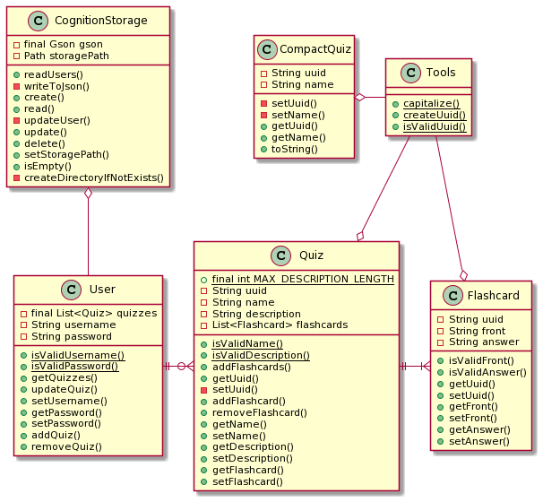
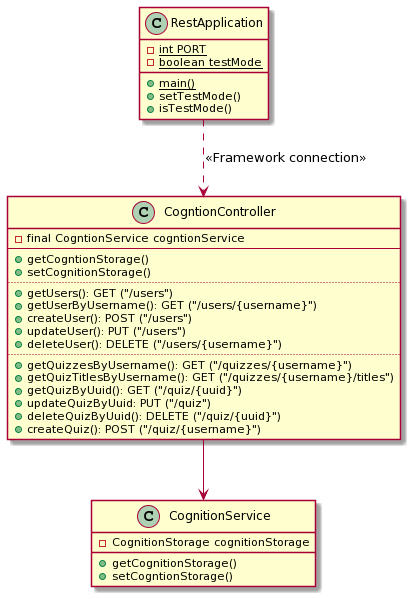

# Diagram documentation

## Architecture documentation

[Click here](../release2/ARCHITECTURE.md) to read the architecture documentation, with illustrating diagrams.

## Package documentation

This package diagram shows the dependencies of each module and package in the Cognition application.

**Please note that we have chosen to highlight runtime dependencies for each module.**

## Class diagram documentation

This class diagram shows the relationship between the classes in the core module.

This class diagram shows the rellationship between the classes in the api module

## Sequence diagram documentation

### Creating a quiz

This sequence diagram shows the flow of creating a new quiz in the Cognition application.

