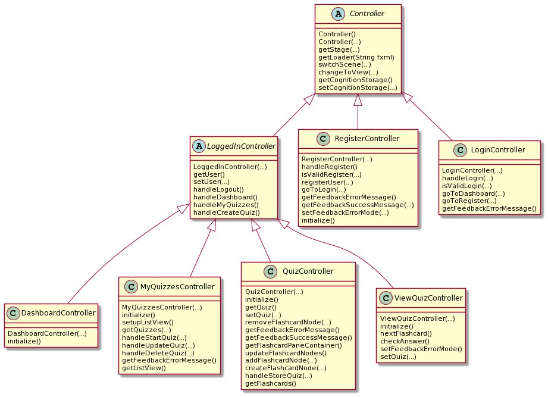
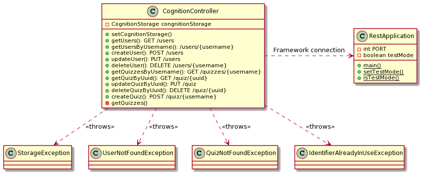

# Diagram documentation

## Architecture documentation

[Click here](../release2/ARCHITECTURE.md) to read the architecture documentation, with illustrating diagrams.

## Package documentation

This package diagram shows the dependencies of each module and package in the Cognition application.

**Please note that we have chosen to highlight runtime dependencies for each module.**

## Class diagram documentation

<<<<<<< HEAD
We have chosen to model the class diagrams for all modules in two different ways. The result is an `abstract` and `detailed` version of each class diagram. The `abstract` diagram helps a new developer get an overview of the relationships and roles of each class before reading the `detailed` version, which in essence, is the more familiar way of drawing class diagrams. We choose this way of presenting the modules as it helps new developers to the project quickly understand the purpose of each class and how that comes into play in the broader task of the module.

Additionaly none of the `detailed` class diagram does not include setter and getter methods as well as variables and functions that are not necesary to get an overview of the classes function and its relationship to other classes. For a more detailed explanation of each module please navigate to the documentation of the module.

### Core

**Abstracted**

**Detailed**

### API

**Abstracted**

**Detailed**

### UI

**Abstracted**

**Detailed**

=======
This class diagram shows the relationship between the classes in the core module.

This class diagram shows the relationship between the classes in the api module.

>>>>>>> 958df8a92f740138dff2c77369cb170c0f91ef74

## Sequence diagram documentation

### Creating a quiz

This sequence diagram shows the flow of creating a new quiz in the Cognition application.

