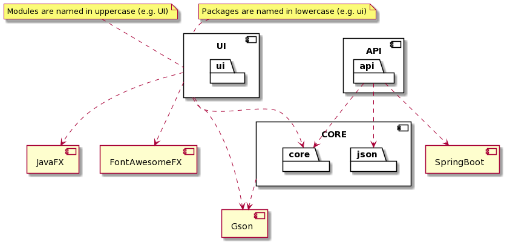
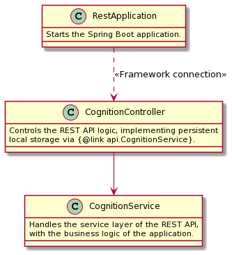
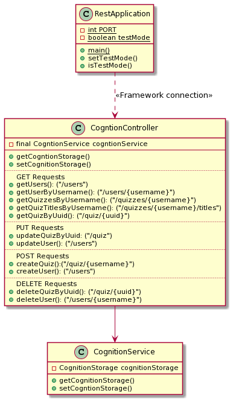

# Diagram documentation

## Architecture documentation

[Click here](../release2/ARCHITECTURE.md) to read the architecture documentation, with illustrating diagrams.

## Package documentation

This package diagram shows the dependencies of each module and package in the Cognition application.

**Please note that we have chosen to highlight runtime dependencies for each module.**

## Class diagram documentation

We have chosen to both model these relationships abstracted and detailed. This is done in order for a new developer to
get an abstracted overview of the relationships before reading the details of a UI controller.

### Core

**Abstracted**

**Detailed**

### API

**Abstracted**

**Detailed**

## Sequence diagram documentation

### Creating a quiz

This sequence diagram shows the flow of creating a new quiz in the Cognition application.

